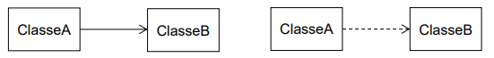

# Exercice UML – Association vs Dépendance

Ce diagramme illustre deux types de relations possibles entre deux classes en UML : **association** et **dépendance**.

## 1. Association (ligne continue)



- **Définition** : Une relation forte et persistante.
  La classe **A** possède une référence directe vers la classe **B**.
- **Traduction en code** (attribut d’instance) :

  ```java
  class ClasseB { }

  class ClasseA {
      private ClasseB b; // Association persistante

      public ClasseA(ClasseB b) {
          this.b = b;
      }
  }
  ```

## 2. Dépendance (ligne pointillée)

- **Définition** : Une relation temporaire.
  La classe **A** dépend de la classe **B**, mais seulement dans une méthode ou une opération ponctuelle.
- **Traduction en code** (paramètre ou variable locale) :

  ```java
  class ClasseB { }

  class ClasseA {
      public void utiliser(ClasseB b) {
          // Utilisation ponctuelle de B
          b.faireQuelqueChose();
      }
  }
  ```

## Résumé

- **Association (———>)** : relation forte → se traduit souvent par un **attribut**.
- **Dépendance (------>)** : relation faible → se traduit souvent par un **paramètre de méthode** ou une **variable locale**.

Exemple de la vie courante :

- Une **Voiture** a un **Moteur** (association).
- Une **Voiture** va à une **StationService** pour faire le plein (dépendance).
