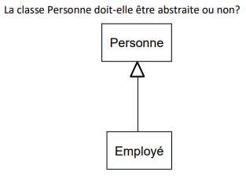

# Exercice UML – Classe abstraite ou non ?

Ce diagramme UML montre une relation d’héritage entre deux classes :



## Question

La classe **Personne** doit-elle être abstraite ou non ?

## 1. Classe abstraite

Si l’on considère que le concept de **Personne** est trop général et qu’il n’a pas de sens concret sans spécialisation (ex. _Employé_, _Client_, _Visiteur_), alors la classe doit être **abstraite**.

- On ne peut pas instancier directement une **Personne**.
- On peut uniquement instancier ses sous-classes.

**Code Java :**

```java
abstract class Personne {
    private String nom;
    private int age;

    public String getNom() { return nom; }
}

class Employe extends Personne {
    private String poste;

    public String getPoste() { return poste; }
}
```

## 2. Classe concrète

Si l’on veut pouvoir représenter une **Personne générique** (ex. une personne dans le système qui n’est pas forcément employée), alors la classe peut être **concrète**.

- On peut créer des objets de type **Personne** directement.
- Les sous-classes comme **Employé** ajoutent des précisions.

**Code Java :**

```java
class Personne {
    private String nom;
    private int age;
}

class Employe extends Personne {
    private String poste;
}
```

## Résumé

- **Classe abstraite** : si toutes les personnes du modèle doivent être des cas particuliers (`Employé`, `Client`, etc.).
- **Classe concrète** : si on veut pouvoir avoir une instance générique de `Personne`.

👉 Dans ce schéma précis, comme la seule spécialisation montrée est `Employé`, il est logique de faire de `Personne` une **classe abstraite**.
