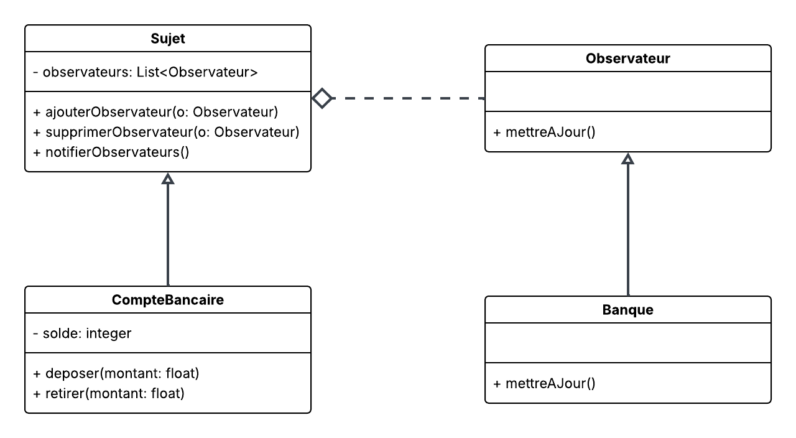

# Exercice UML – Notification automatique de la banque

Une banque désire être avisée automatiquement lorsque le solde d’un compte atteint une condition critique :

- **Solde négatif inférieur à -1000 $**
- **Solde positif supérieur à 10'000 $**

Les opérations possibles sur le compte sont :

- `déposer`
- `retirer`

La question est donc : **quel patron de conception peut aider à implémenter cette fonctionnalité ?**

## 1. Patron de conception : Observateur

Le **patron Observateur** est idéal dans ce cas, car il permet à la banque d’être notifiée automatiquement lorsqu’un compte bancaire change d’état (ici, le solde).

- La **banque** joue le rôle d’**observateur**.
- Le **compte bancaire** est le **sujet observé**.
- Lorsqu’une opération modifie le solde (`déposer` ou `retirer`), le compte **notifie ses observateurs** (la banque).
- La banque vérifie alors si le solde est hors des limites et réagit en conséquence.

## 2. Diagramme UML simplifié



## 3. Pseudocode

Voici un pseudocode illustrant l’utilisation du patron Observateur dans ce contexte :

```java
// Interface Observateur
interface Observateur {
    void mettreAJour(Sujet s);
}

// Classe Banque qui implémente Observateur
class Banque implements Observateur {
    @Override
    void mettreAJour(Sujet s) {
        if (s instanceof CompteBancaire) {
            CompteBancaire compte = (CompteBancaire) s;

            // Vérifier les conditions
            if (compte.getSolde() < compte.getSeuilNegatif()
                || compte.getSolde() > compte.getSeuilPositif()) {
                System.out.println("ALERTE : Solde du compte "
                    + compte.getNumCompte() + " hors des limites!");
            }
        }
    }
}

// Classe Sujet (abstraite)
abstract class Sujet {
    List<Observateur> observateurs;

    void ajouterObservateur(Observateur o) { ... }
    void supprimerObservateur(Observateur o) { ... }
    void notifierObservateurs() {
        for (Observateur o : observateurs) {
            o.mettreAJour(this);
        }
    }
}

// Classe CompteBancaire (hérite de Sujet)
class CompteBancaire extends Sujet {
    double solde;

    void deposer(double montant) {
        solde += montant;
        notifierObservateurs();
    }

    void retirer(double montant) {
        solde -= montant;
        notifierObservateurs();
    }
}
```

## 4. Exemple d’utilisation

```java
CompteBancaire compte = new CompteBancaire();
Banque banque = new Banque();

compte.ajouterObservateur(banque);

compte.deposer(5000);
compte.retirer(1200);
compte.deposer(8000);

// La banque reçoit une alerte si le solde est hors des limites
```

## Résumé

- Le patron **Observateur** permet d’automatiser la **notification de la banque** lorsqu’un compte sort de ses limites.
- Les classes principales sont :

  - **Sujet** (ici `CompteBancaire`),
  - **Observateur** (ici `Banque`).

- La banque est alertée **sans couplage direct fort** entre les classes, ce qui rend le système extensible.
