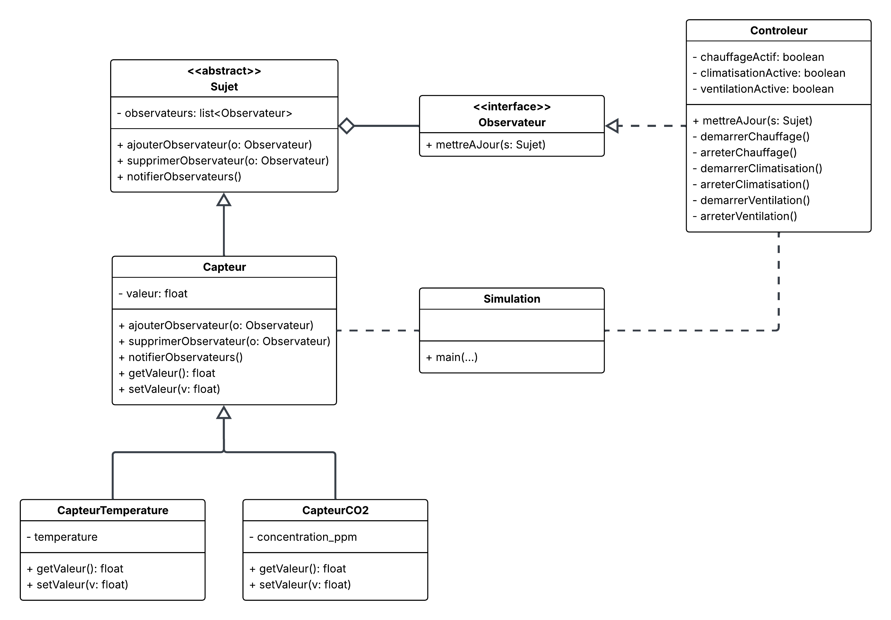

# Laboratoire : Patron de conception Observateur

## 🎯 Objectif du laboratoire
Ce laboratoire a pour but de comprendre et d’appliquer le **patron de conception Observateur** en Java.
L’objectif est de modéliser et d’implémenter une application simple qui simule le contrôle de la température et de la concentration de CO₂ d’une pièce, en appliquant les principes d’**héritage**, d’**interfaces** et de **faible couplage**.

## 📝 Description du projet
L’application représente une pièce équipée de deux capteurs :
- **Capteur de température** (°C)
- **Capteur de CO₂** (ppm)

La pièce est également munie d’un **contrôleur**, chargé de maintenir les conditions de confort :
- Maintenir la température à **22 °C**
  - Démarrer le chauffage si la température est trop basse
  - Démarrer la climatisation si la température est trop élevée
- Maintenir la qualité de l’air en dessous de **1000 ppm de CO₂**
  - Démarrer la ventilation si le CO₂ est trop élevé

Lorsque les valeurs redeviennent normales, les systèmes correspondants s’arrêtent automatiquement.

## 📐 Conception UML
La conception s’appuie sur le **patron Observateur** :
- Les **capteurs** jouent le rôle de **sujets observables**.
- Le **contrôleur** est un **observateur** qui réagit aux changements des capteurs.
- La classe `Simulation` sert de **point d’entrée** de l’application et orchestre la création des objets.

Voici le diagramme UML qui illustre cette conception :



## 📂 Structure du projet

```bash
├── README.md               # Présentation du laboratoire
└── src                     # Code source Java
    ├── Capteur.java
    ├── CapteurCO2.java
    ├── CapteurTemperature.java
    ├── Controleur.java
    ├── Observateur.java
    ├── Simulation.java     # Classe principale
    └── Sujet.java
```

- `Capteur` : classe abstraite pour les capteurs (valeur mesurée + notification).
- `CapteurCO2` : capteur mesurant la concentration de CO₂.
- `CapteurTemperature` : capteur mesurant la température.
- `Controleur` : implémentation d’`Observateur`, prend les décisions (chauffage, climatisation, ventilation).
- `Observateur` : interface définissant la méthode `mettreAJour()`.
- `Simulation` : contient la méthode `main()`, permet d’entrer manuellement les valeurs pour tester le système.
- `Sujet` : classe abstraite représentant l’objet observable (gestion des observateurs).

## ▶️ Exécution
1. Compiler les fichiers Java dans le dossier `src` :
   ```bash
   javac src/*.java
   ```

2. Lancer la simulation :

   ```bash
   java -cp src Simulation
   ```

3. Entrer les valeurs de température et de CO₂ manuellement dans la console.
   Le contrôleur réagit automatiquement et affiche l’état des systèmes (chauffage, climatisation, ventilation).

## ✅ Résultats attendus

Exemples de comportements du contrôleur :

* Si la température passe à **18 °C**, le chauffage démarre.
* Si la température monte à **26 °C**, la climatisation démarre.
* Si le CO₂ atteint **1200 ppm**, la ventilation démarre.
* Lorsque les valeurs reviennent à la normale, les systèmes correspondants s’arrêtent.

## 📌 Conclusion

Ce laboratoire illustre l’utilisation du **patron de conception Observateur** pour réduire le couplage entre les composants d’un système de contrôle.
Grâce à l’héritage (`CapteurTemperature`, `CapteurCO2`) et à l’interface (`Observateur`), la conception est extensible et respecte les principes de la programmation orientée objet.
